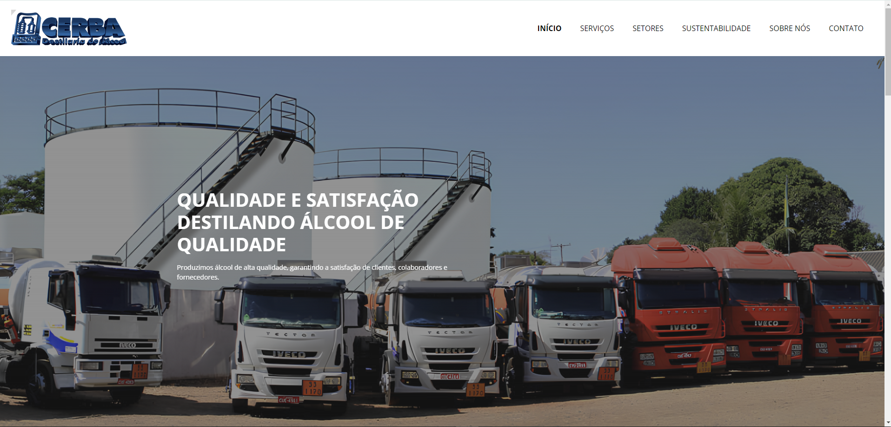
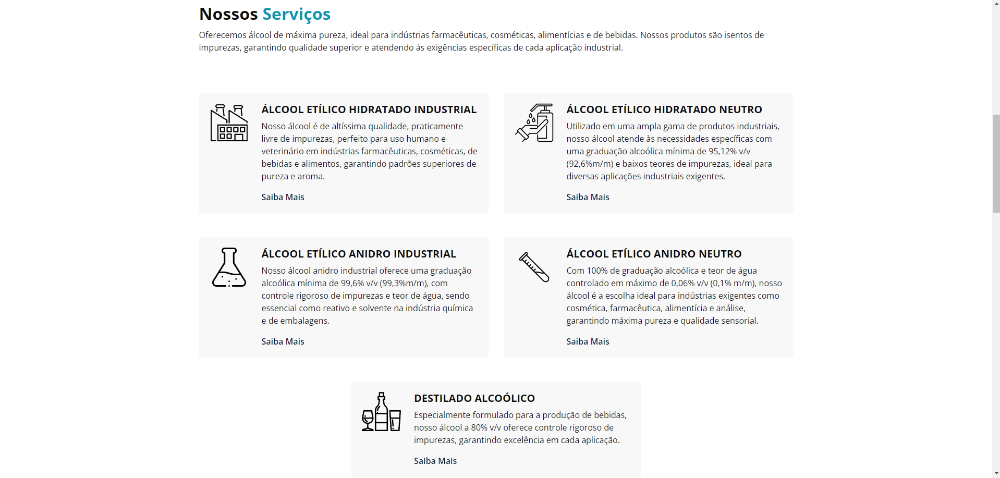
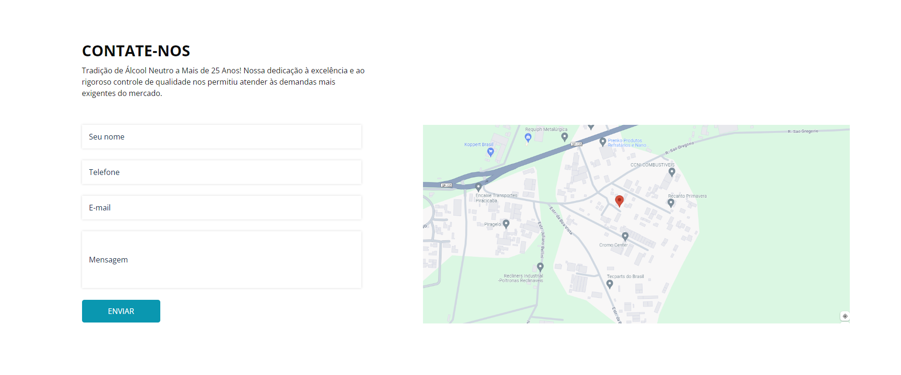
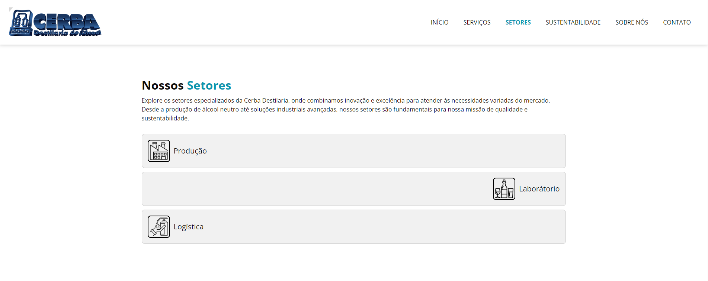
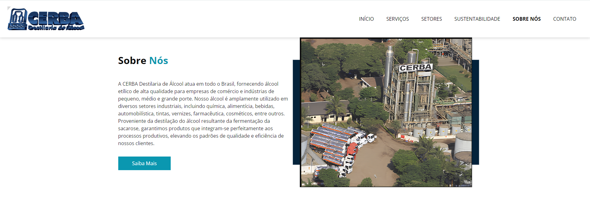

"# WebSite-Cerba" 
# Site Cerba

### Abaixo Segue Alguns Prints Do Site

### Tela Home do Site:

### Tela de Resumo do Serviços:

### Tela de Contato

### Tela Dos Setores:

### Tela Sobre a Empresa:

# Descrição

Este é o projeto da Cerba, uma empresa dedicada à produção de álcool neutro, destilado alcoólico e anidro neutro. O site tem como objetivo fornecer informações detalhadas sobre os produtos, serviços e valores da empresa, além de facilitar a comunicação com clientes, colaboradores e fornecedores.

# Funcionalidades

Página Inicial: Visão geral da empresa e links para as principais seções do site.
Sobre Nós: Informações sobre a missão, visão e valores da Cerba.
Produtos: Detalhes sobre os tipos de álcool produzidos, suas especificações e usos.
Sustentabilidade: Descrição das práticas sustentáveis e responsabilidade social da empresa.
Contato: Formulário de contato e informações de contato direto.
Blog/Notícias: Atualizações e notícias relevantes sobre a empresa e o setor.

# Tecnologias Utilizadas

Front-end: HTML, CSS, JavaScript.

